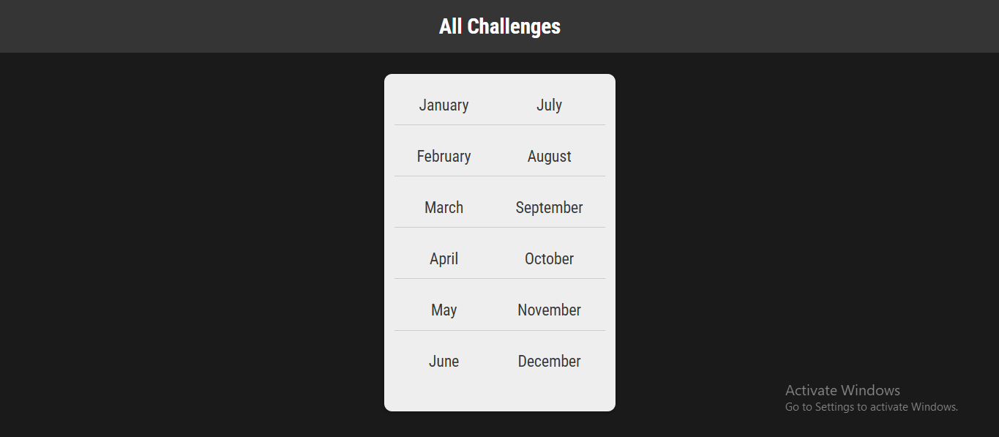

# Django Monthly Challenges Webapp

## Overview

Django Monthly Challenges Webapp is a simple Django-based web application that presents monthly challenges to users. Each month has a dedicated challenge, and users can navigate through them dynamically.



## Features

- View challenges for each month
- URL routing for different months
- Django admin panel for management
- Modular Django app structure

## Technologies Used

- Python
- Django
- HTML & CSS (for templates)

## Installation & Setup

### Prerequisites

Ensure you have Python installed (preferably Python 3.8+). You can download it from [python.org](https://www.python.org/downloads/).

### Steps

1. **Clone the repository**
   ```sh
   git clone <repository-url>
   cd Django_Monthly_Challenges_Webapp
   ```
2. **Create a virtual environment and activate it**
   ```sh
   python -m venv venv
   source venv/bin/activate  # On Windows use: venv\Scripts\activate
   ```
3. **Install dependencies**
   ```sh
   pip install -r requirements.txt
   ```
4. **Apply migrations**
   ```sh
   python manage.py migrate
   ```
5. **Run the development server**
   ```sh
   python manage.py runserver
   ```
   The application will be available at `http://127.0.0.1:8000/`.

## Usage

- Open the browser and navigate to `http://127.0.0.1:8000/`
- Click on different months to view the respective challenge.

## Project Structure

```
Django_Monthly_Challenges_Webapp/
│── challenges/
│   ├── migrations/
│   ├── templates/
│   ├── views.py
│   ├── models.py
│   ├── urls.py
│── manage.py
│── db.sqlite3
```

## Contributing

Feel free to fork the repository and submit pull requests for improvements!

## License

This project is licensed under the MIT License.

